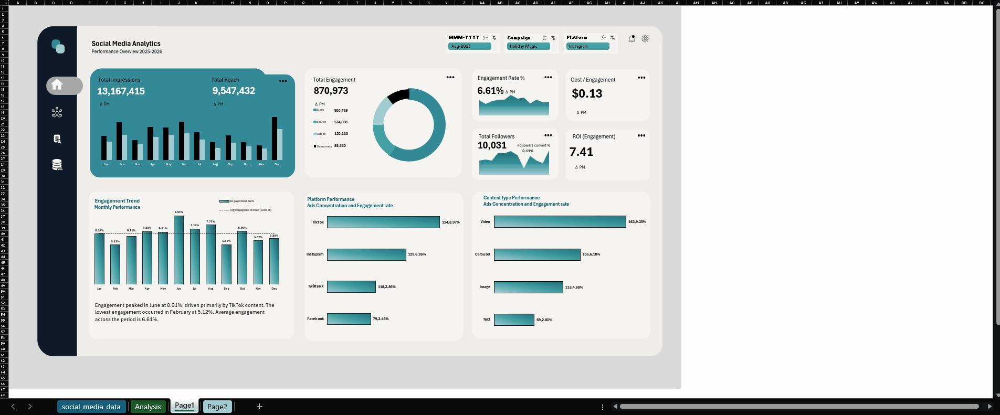

# Social Media Performance Analysis
### An Interactive Two-Page Excel Analytics Dashboard — Power Query · Power Pivot · DAX

A data-driven Excel dashboard that turns 450 social media posts into a platform, content, and campaign strategy for a consumer lifestyle brand — built end-to-end from a raw CSV to a fully interactive, slicer-driven executive dashboard.

[]()
[]()
[]()
[]()
[]()



---

## Table of Contents
- [Overview](#overview)
- [The Business Problem](#the-business-problem)
- [Dataset](#dataset)
- [Data Modeling & the DAX Layer](#data-modeling--the-dax-layer)
- [Dashboard Walkthrough](#dashboard-walkthrough)
  - [Page 1 — Executive Overview](#page-1--executive-overview)
  - [Page 2 — Strategic Performance Analysis](#page-2--strategic-performance-analysis)
- [Design & Build Process](#design--build-process)
- [Key Insights & Recommendations](#key-insights--recommendations)
- [Tech Stack](#tech-stack)
- [Repository Structure](#repository-structure)
- [How to Explore the Dashboard](#how-to-explore-the-dashboard)
- [Documentation](#documentation)
- [Author](#author)

---

## Overview

An agency manages social media marketing for a consumer lifestyle brand across **Instagram, TikTok, Twitter/X, and Facebook**. Reach looked strong on paper, but platform focus, content strategy, and campaign budgets were being decided on intuition rather than data. This project delivers the analytics layer to fix that — a full Excel Data Model, a 37-measure DAX layer, exploratory analysis answering eight specific business questions, and a two-page interactive dashboard leadership can use to plan the next quarter's campaigns.

**At a glance**

| Posts Analyzed | Impressions | Reach | Engagements | Spend Analyzed | DAX Measures | Dashboard Pages |
|:---:|:---:|:---:|:---:|:---:|:---:|:---:|
| 450 | 13.17M | 9.55M | 870,973 | $117,573 | 37 | 2 |

**Core capabilities demonstrated**
- End-to-end BI workflow — raw CSV → Power Query → Excel Data Model → DAX → pivot-based EDA → interactive dashboard
- Relational data modeling — fact table + Calendar dimension on a 1-to-many relationship, built for time intelligence
- 37 hand-written DAX measures, including composite scoring, month-over-month time intelligence, and measures that generate their own natural-language insight text
- Stakeholder-driven analysis — scoped directly against a written business brief and eight explicit questions
- Dashboard/UX design — wireframed in Figma first, then rebuilt as a lightweight, fully cross-filtered two-page Excel dashboard

---

## The Business Problem

The project was scoped against a written analytics brief from the brand's Director of Digital Marketing. In short:

> Marketing had been publishing across four platforms for a year. Overall reach looked healthy, but reporting stopped at vanity metrics — likes and impressions — with no structured view of what was actually driving engagement or follower growth. Platform focus, content production, and campaign budget were being decided on intuition. Leadership needed a data-driven view before locking the next quarter's strategy.

**The brief asked for answers to:**

| Theme | Questions |
|---|---|
| **Platform Performance** | Which platform generates the highest engagement rate? Which drives the most impressions and engagement overall? |
| **Content Strategy** | Which content format performs best? Are certain formats more effective on specific platforms? |
| **Campaign Effectiveness** | Which campaigns generated the most engagement and follower growth? Which underperformed? |
| **Engagement Efficiency** | Does higher impressions volume lead to stronger engagement, or are we just reaching passive audiences? |
| **Content Outliers** | Which individual posts significantly outperform the rest? |

**Required deliverables:** a structured Data Model with DAX measures, a two-page interactive dashboard (an executive overview and a deep-dive analysis page), and a short strategic insight memo — all built on Excel Power Pivot, DAX, PivotTables/PivotCharts, and slicers.

---

## Dataset

`social_media_data` — **450 posts** spanning a full year (**March 2025 – March 2026**) across Instagram, TikTok, Twitter/X, and Facebook. The raw export carries 26 fields covering platform, content, cost, and performance data, plus one calculated column added directly in Excel — `Is_Viral`, flagged `"Viral"` when a post's total engagement exceeds **5× the average post engagement**.

Full column-level definitions are documented in [`data/data.dictionary.md`](data/data.dictionary.md).

---

## Data Modeling & the DAX Layer

The raw range was converted to a native Excel Table, loaded through **Power Query** (`Data → From Table/Range → Close & Load To… Data Model`), and renamed `social_media_data`. Inside **Power Pivot**, an auto-generated **Calendar** date table (March 2025 – March 2026) was built for time intelligence and connected to `social_media_data` on `Date → Post_Date` as a 1-to-many relationship — the backbone that makes every month-over-month measure and slicer work correctly.

On top of that model sit **37 DAX measures across 7 categories**:

| # | Category | Measures | What it covers |
|:--:|---|:--:|---|
| 01 | Core Metrics | 8 | Foundational aggregations — Total Engagement, Impressions, Reach, Cost, Posts, Followers, Avg Reach, Avg Engagement |
| 02 | Rate & Efficiency | 7 | Engagement Rate, Likes/Comments/Shares/Saves %, CTR, Follower Conversion Rate |
| 03 | Cost & ROI | 6 | Cost Per Engagement, CPM, Cost Per Follower, ROI, Organic CPE, Boosted CPE |
| 04 | Advanced Scoring | 3 | Weighted Engagement Quality Score, Campaign Efficiency Index, global Avg Engagement Rate benchmark |
| 05 | KPI Comparison (MoM) | 6 | Dynamic ▲ / ▼ month-over-month text for Engagement, Impressions, Reach, Engagement Rate, CPE, and ROI |
| 06 | Dynamic Insight Text | 4 | Measures that write their own natural-language summary as slicers change — `Viral Flag`, `Monthly Engagement Summary`, `Platform Media Insight`, `Strategic Summary` |
| 07 | Row-Level Helpers | 3 | `MAX()`-based helpers exposing Platform / Content Type / Boosted status inside non-aggregated table visuals |

A few measures worth calling out:

```dax
Viral Flag =
VAR GlobalAvg =
    CALCULATE([Avg Engagement], ALL(social_media_data))
RETURN
    IF([Total Engagement] > GlobalAvg * 5, "Viral", "Normal")
```

```dax
Engagement Quality Score =
    (SUM(social_media_data[Likes])    * 1) +
    (SUM(social_media_data[Comments]) * 3) +
    (SUM(social_media_data[Shares])   * 5) +
    (SUM(social_media_data[Saves])    * 4)
```

The **Dynamic Insight Text** category is the most advanced part of the model — measures like `Strategic Summary` use a `TOPN` + `MAXX` pattern to find the current top-performing platform, content type, campaign, and time slot, then concatenate them into a sentence that rewrites itself live as the slicers change (it's the text block in the teal card on Page 2). The **KPI Comparison** category follows a consistent `VAR` + `DATEADD('Calendar'[Date], -1, MONTH)` pattern to build the ▲/▼ "vs last month" labels behind every KPI card on Page 1.

Every measure — full formula plus a plain-English explanation — is documented in [`docs/DAX_Measures_Reference_Guide.pdf`](docs/DAX_Measures_Reference_Guide.pdf).

---

## Dashboard Walkthrough

### Page 1 — Executive Overview


A high-level performance snapshot for leadership, filterable by **Month, Campaign, and Platform**:

- **KPI cards** — Total Impressions (13.17M) and Total Reach (9.55M) sit above a 12-month bar chart comparing the two; each of the six smaller cards (Total Engagement, Engagement Rate, Cost/Engagement, Total Followers, ROI) is a borderless, 28pt dynamic text box wired directly to the Data Model, with a live-captured ▲/▼ month-over-month indicator underneath, generated by the `KPI Comparison` DAX measures and snapshotted with Excel's Camera tool.
- **Content interaction donut** — breaks the 870,973 total engagements into their four components: Likes (500,759), Shares (134,888), Link Clicks (120,133), and Comments (88,550).
- **Total Followers / ROI cards** — 10,031 followers gained at a 0.11% follower-conversion rate, against an engagement ROI of 7.41 engagements per dollar spent.
- **Engagement Trend chart** — monthly engagement rate against a global benchmark line (the account average, 6.61%), with a caption paragraph underneath written entirely by the `Monthly Engagement Summary` DAX measure — it identifies the best month, worst month, and top-driving platform on its own.
- **Platform Performance chart** — TikTok (124 posts, 8.97% engagement rate) leads, ahead of Instagram (129, 6.26%), Twitter/X (118, 3.86%), and Facebook (79, 3.46%).
- **Content Type Performance chart** — Video (163 posts, 9.35%) is the clear leader over Carousel (105, 6.10%), Image (113, 4.88%), and Text (69, 2.85%).
- **Navigation** — a rounded pill sidebar with flat icons links to Page 1, Page 2, the Analysis sheet, and the raw Data Set via native Excel hyperlinks.

### Page 2 — Strategic Performance Analysis


The deep-dive page, built to identify *why* performance looks the way it does:

- **Platform-Content Performance Matrix** — a conditional-formatted heatmap of engagement rate by platform × content type. TikTok Video is the standout cell at 14.03%; Instagram Carousel is its own strong niche at 7.63%; Text underperforms on every platform.
- **Marketing Campaign Performance** — total engagement and follower growth side by side for all six campaigns. Summer Vibes leads on total engagement (269,120) and rate (8.08%); Spring Launch drove the most follower growth (2,833); Back to School is the clear underperformer (50,982 engagements, 5.18% rate).
- **Boosted vs. Organic** — boosted posts average 3,542 engagements and 38,218 reach per post versus 1,247 and 13,930 organic — roughly a 2.7–2.8× lift — at a close cost-per-engagement gap ($0.14 boosted vs. $0.12 organic).
- **Engagement Rate by Posting Time** — Afternoon (7.47%) and Evening (7.15%) clearly outperform Morning (5.69%) and Midday (5.53%).
- **Top Performing Posts table** — the 11 posts that crossed the 5×-average viral threshold, ranked by total engagement, tagged with platform, media type, and boosted status. The top post (`POST_0057`, a boosted TikTok video) pulled 33,252 engagements — about 17× the account average.
- **Strategic Insights card** — a fully dynamic paragraph generated by the `Strategic Summary` measure, synthesizing the top platform, content type, campaign, and time slot into one sentence that updates with every slicer change.
- Same slicer set and navigation bar as Page 1, so filtering carries across both pages.

---

## Design & Build Process

- **Wireframed first in Figma** — both dashboard pages were laid out and iterated on in Figma before a single chart was built in Excel, to lock spacing, hierarchy, and the teal/navy visual identity ahead of time.
- **Screenshot-based build** — wireframe components were re-created as high-resolution Snipping Tool captures and inserted via `Insert → Picture → Place Over Cell`, keeping the workbook lightweight instead of relying on hundreds of native shape objects.
- **Custom chart templates** — the gradient area/donut charts were tuned once (ring thickness, gap width, color stops) and saved as reusable `.crtx` Excel Chart Templates.
- **Live MoM indicators** — conditional-formatting rules render green ▲ / red ▼ arrows (inverted for cost metrics), captured live with Excel's Camera tool so the KPI cards stay pixel-accurate as the underlying DAX values change.
- **Custom slicer theme** — a duplicated slicer style with borders removed, an off-white fill, and pink accent highlighting for selected items.
- **Cross-filtering** — all PivotTables are wired together through Report Connections, with the top-line monthly KPI cards deliberately excluded from the Month slicer so month-over-month comparisons stay accurate regardless of what's filtered elsewhere.
- **Navigation** — rounded pill buttons with flat icons, linked with native Excel hyperlinks (`Insert → Link → Place in This Document`) for instant tab switching between Page 1, Page 2, Analysis, and the raw Data Set.

---

## Key Insights & Recommendations

1. **TikTok leads, and it isn't close** — 8.97% engagement rate against Instagram's 6.26%, Twitter/X's 3.86%, and Facebook's 3.46%, on a real sample of 124 posts. TikTok should be first priority for content investment; Instagram second.
2. **Video is the format that moves people** — 9.35% average engagement rate against 6.10% for Carousel, 4.88% for Image, and 2.85% for Text. The gap is even sharper on TikTok specifically (14.03% for video). A video-first content calendar is the clear implication.
3. **Campaigns are not created equal** — Summer Vibes was the most efficient campaign of the year (269,120 engagements at an 8.08% rate); Spring Launch drove the most follower growth (2,833); Back to School lagged on both (50,982 engagements, 5.18% rate). The winning formula — seasonal hook, video-forward, one clear visual identity — is worth repeating.
4. **Reach genuinely converts to engagement** — a 0.78 correlation between impressions and total engagement says high-reach posts are earning real interaction, not just passive views.
5. **Boosting buys scale, not efficiency** — boosted posts pull 2.7–2.8× more reach and engagement per post than organic, but at a slightly *lower* engagement rate (paid reach adds more passive impressions) and a similar cost per engagement ($0.12 organic vs. $0.14 boosted). The better play is to publish organically first and boost selectively based on what's already gaining traction.
6. **Afternoon posting wins** — a ~2-point gap between the best posting window (Afternoon, 7.47%) and the worst (Midday, 5.53%), on otherwise identical content. A free, zero-cost scheduling change.
7. **Production budget has only a mild link to performance** — a 0.41 correlation between production cost and engagement rate suggests strategy (platform, format, timing) matters more than spend.
8. **Follower growth is the number to watch** — a 0.11% follower-conversion rate against a healthy engagement quality score (1.55M) suggests the audience is genuinely interacting, but that interaction isn't yet reliably converting into new followers — a natural next KPI to target.

---

## Tech Stack

- **Microsoft Excel** — dashboard, workbook, and PivotTable/PivotChart engine
- **Power Query (M)** — data ingestion and shaping
- **Power Pivot / Excel Data Model** — relational model (Calendar dimension ↔ fact table)
- **DAX** — 37 custom measures across 7 categories, including time intelligence and dynamic text generation
- **Figma** — dashboard wireframing and layout design

---

## Repository Structure

```
├── data/
│   ├── data.dictionary.md
│   └── social_media_dataset.csv
├── docs/
│   ├── Business_Problem.pdf
│   ├── DAX_Measures_Reference_Guide.pdf
│   └── social_media_executive_report.pdf
├── images/
│   ├── Report.gif
│   ├── Wireframe 1.png
│   ├── Wireframe 2.png
│   ├── page 1.png
│   └── page 2.png
├── .gitattributes
├── LICENSE
├── README.md
└── Social Media Performance Analysis.xlsx
```

---

## How to Explore the Dashboard

1. Clone or download the repo, then open **`Social Media Performance Analysis.xlsx`** in Excel (2016 or later, for full Power Pivot / Data Model support).
2. Enable content/editing if prompted, so the Data Model, PivotTables, and slicers are fully interactive.
3. Use the **Platform**, **Campaign**, and **Month** slicers on Page 1 or Page 2 — they cross-filter every visual on that page at once.
4. Use the pill navigation bar on the left to jump between **Page 1** (executive overview), **Page 2** (strategic analysis), **Analysis** (the PivotTables behind every chart), and the raw **Data Set**.
5. If you swap in your own data via `data/social_media_dataset.csv`, refresh the model with `Data → Refresh All`.

---

## Documentation

| File | Contents |
|---|---|
| [`data/social_media_dataset.csv`](data/social_media_dataset.csv) | The raw 450-post dataset |
| [`data/data.dictionary.md`](data/data.dictionary.md) | Column-level field definitions |
| [`docs/Business_Problem.pdf`](docs/Business_Problem.pdf) | The stakeholder brief that scoped this project |
| [`docs/DAX_Measures_Reference_Guide.pdf`](docs/DAX_Measures_Reference_Guide.pdf) | Full formula and explanation for all 37 DAX measures |
| [`docs/social_media_executive_report.pdf`](docs/social_media_executive_report.pdf) | The strategic insight memo summarizing findings and recommendations |

---

## Author

**Ziad Kamel** — Computer Science graduate focused on data engineering & analytics.

[LinkedIn](https://www.linkedin.com/in/ziadkamel1) · [zaidkamel393@gmail.com](mailto:zaidkamel393@gmail.com)

Licensed under the terms in [`LICENSE`](LICENSE).
